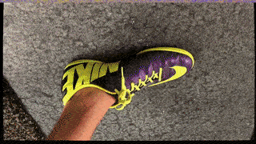

# Meshroom Video Demo

Demo python jupyter notebook to process a video and re-render the mesh overlaid onto the original frames

Uses a custom graph file to export undistorted frames, along with the camera poses for each frame.
Then renders a video of the reconstructed mesh onto the original frames.
Useful for re-projecting points back into the reconstruction.

